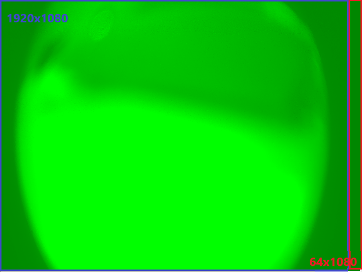

AmbaSDK 内存区划分可参考 _`Ambarella_CV2x_DG_Flexible_Linux_SDK3.0_DRAM_Optimization.pdf`_

获取yuv数据思路为先映射内存DRAM中DSP部分的内存到虚拟地址上，接着请求canvas (存放buffer数据流)中数据，得到 YUV的 `y_addr_offset` 和 `uv_addr_offset`，根据offset计算虚拟地址中对应位置。

### 关于 pitch 与 width

其canvas图像(矩阵)在内存中为按行存取,在 1920 x 1080 下读取一行所占字节为
1984 (1920 + 64), 依次读取1080 行，输出图像如下 (仅读取Y分量)

左侧 1920x1080 对应 buffer 提供给 canvas 的 图片数据流。  
__width 为提前设定的图片宽度1920。__ 

右侧 64x1080 为多出部分，其值全为0。  
__pitch 为具体存储一行占用的字节数(两行数据的首地址差值)为 1984 (1920 + 64)__

获得图像数据地址后需要根据 pitch 和 width 关系对应处理数据。

* `pitch > width` 对应读取每行后,舍去 (pitch - width) 个数的字节
* `pitch == width` 无需处理 

### 关于 Y 与 UV

DSP 内存中, Y 与 UV 分开独立存放, 针对具体YUV编码种类，可根据图像大小算出UV所占字节，本次测试使用 YUV420NV12, UV的字节为图像大小的1/2。

__生成YUV 彩图时需要根据 y部分的地址提取对应y分量大小的数据，舍弃pitch中的对齐字节后，再拼接UV分量的数据，同样都要针对`pitch` 和 `width` 进行处理。__